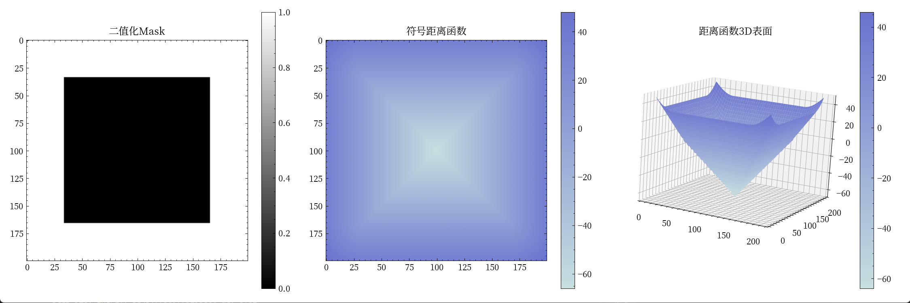

# Level Set方法实现与优化记录

## 1. 基础实现阶段

### 1.1 初始化
- 实现了基本的符号距离函数初始化
- 改进为平滑的初始化方法
- 调整初始轮廓大小为图像尺寸的1/3

#### 1.1.1 符号距离函数可视化


从左到右三幅图分别展示了：
1. **二值化Mask**：
   - 中心区域（黑色）表示初始轮廓内部，值为0
   - 外部区域（白色）表示轮廓外部，值为1
   - 清晰展示了初始分割的边界

2. **符号距离函数**：
   - 展示了从边界到各点的最短距离
   - 内部区域为负值（蓝色），表示在轮廓内
   - 外部区域为正值（红色），表示在轮廓外
   - 边界处的值为0，形成了一个平滑的过渡

3. **距离函数3D表面**：
   - 直观展示了距离场的"山谷"形状
   - 中心区域形成凹陷，表示负距离值
   - 外围区域向上隆起，表示正距离值
   - 边界处形成"零等高线"

#### 1.1.2 数学表达式与实现
1. **二值化函数**：

$$
M(x,y) = \begin{cases} 
0, & \text{如果 } (x,y) \text{ 在轮廓内部} \\
1, & \text{如果 } (x,y) \text{ 在轮廓外部}
\end{cases}
$$

2. **欧式距离变换**：

$$
d((x,y), \Gamma) = \min_{(x',y')\in \Gamma} \sqrt{(x-x')^2 + (y-y')^2}
$$

其中，$\Gamma$表示轮廓边界。

3. **符号距离函数**：

$$
\phi(x,y) = \begin{cases}
-d((x,y), \Gamma), & \text{如果 } M(x,y) = 0 \\
d((x,y), \Gamma), & \text{如果 } M(x,y) = 1
\end{cases}
$$

代码实现：
```python
def _create_initial_smooth_phi(self):
    rows, cols = self.image.shape
    # 1. 创建二值mask
    mask = np.ones((rows, cols))
    center_r, center_c = rows//2, cols//2
    r_radius, c_radius = rows//3, cols//3
    mask[center_r-r_radius:center_r+r_radius, 
         center_c-c_radius:center_c+c_radius] = 0
    
    # 2. 计算欧式距离
    distance_outside = ndimage.distance_transform_edt(mask)      # 外部距离
    distance_inside = ndimage.distance_transform_edt(1-mask)     # 内部距离
    
    # 3. 构建符号距离函数
    return distance_outside - distance_inside
```
#### 1.1.3 零水平集的概念与性质

零水平集是水平集方法中的核心概念，用于表示分割边界或演化曲线。

1. **水平集函数的定义**

水平集函数 $\phi(x,y)$ 是定义在图像二维空间 $(x,y)$ 上的标量函数：
- 对于任意常数 $c$，集合 $\{(x,y)|\phi(x,y)=c\}$ 称为水平集
- 特别地，当 $c=0$ 时，集合 $\{(x,y)|\phi(x,y)=0\}$ 称为零水平集

2. **零水平集的几何意义**

(1) 分割边界表示：
- 前景区域（inside）：$\phi(x,y) \geq 0$
- 背景区域（outside）：$\phi(x,y) < 0$
- 边界：$\phi(x,y) = 0$

(2) 动态演化特性：
- 初始时刻：零水平集表示初始分割边界
- 演化过程：通过演化方程动态调整
- 最终状态：收敛到目标边界

3. **零水平集的数学表示**

(1) 基本方程：
$$
\phi(x,y) = 0
$$

(2) 梯度与法向量：
- 梯度 $\nabla\phi$ 表示水平集函数的变化方向
- 在零水平集上，$\nabla\phi$ 的方向即为法线方向
- 单位法向量：$\vec{n} = \frac{\nabla\phi}{|\nabla\phi|}$

4. **零水平集的作用**

(1) 边界表示：
- 提供了分割边界的隐式表示
- 通过调整 $\phi$ 控制边界位置和形状

(2) 动态演化：
- 基于能量最小化原理
- 结合区域项和边界项
- 逐步逼近目标边界

(3) 隐式表示的优势：
- 自然处理拓扑变化（分裂或合并）
- 易于扩展到高维空间
- 数值计算稳定性好

5. **零水平集与Heaviside函数**

(1) Heaviside函数定义：
$$
H(\phi) = \begin{cases}
1, & \phi \geq 0 \\
0, & \phi < 0
\end{cases}
$$

(2) Dirac函数作用：
$$
\delta(\phi) = \frac{d}{d\phi}H(\phi)
$$

- 集中在零水平集附近
- 用于限制演化在边界附近进行

6. **数值实现**

```python
def _extract_zero_level_set(self):
    """提取零水平集
    """
    # 使用线性插值找到零水平集
    contours = measure.find_contours(self.phi, 0)
    
    # 转换为图像坐标
    zero_level_set = np.zeros_like(self.phi)
    for contour in contours:
        rr, cc = polygon(contour[:, 0], contour[:, 1], zero_level_set.shape)
        zero_level_set[rr, cc] = 1
        
    return zero_level_set

def _visualize_zero_level_set(self):
    """可视化零水平集
    """
    plt.figure(figsize=(12, 4))
    
    # 显示原始图像和零水平集
    plt.subplot(131)
    plt.imshow(self.image, cmap='gray')
    contours = measure.find_contours(self.phi, 0)
    for contour in contours:
        plt.plot(contour[:, 1], contour[:, 0], 'r-', linewidth=2)
    plt.title('Image with Zero Level Set')
    
    # 显示水平集函数
    plt.subplot(132)
    plt.imshow(self.phi, cmap='RdBu')
    plt.colorbar()
    plt.title('Level Set Function')
    
    # 显示3D表面
    ax = plt.subplot(133, projection='3d')
    x, y = np.meshgrid(np.arange(self.phi.shape[1]),
                      np.arange(self.phi.shape[0]))
    ax.plot_surface(x, y, self.phi, cmap='RdBu')
    plt.title('3D Level Set Surface')
    
    plt.tight_layout()
    plt.show()
```

7. **零水平集的特性**

(1) 拓扑适应性：
- 可以自动处理曲线分裂
- 可以处理曲线合并
- 不需要重新参数化

(2) 几何特性：
- 曲率计算方便
- 法向量计算直观
- 边界演化自然

(3) 数值稳定性：
- 避免了参数化方法的奇异性
- 计算过程数值稳定
- 便于实现自适应网格

### 1.2 基本演化

#### 1.2.1 常速度演化
常速度演化是Level Set方法中最基本的演化形式，通过固定速度场来驱动轮廓的运动。

1. **数学表达式**：
常速度演化方程：

$$
\frac{\partial \phi}{\partial t} + F|\nabla \phi| = 0
$$

其中：
- $\phi$ 是水平集函数
- $F$ 是常速度场（标量）
- $|\nabla \phi|$ 是梯度幅值

2. **离散化实现**：
使用前向时间差分和空间中心差分：

$$
\phi^{n+1} = \phi^n - \Delta t \cdot F \cdot |\nabla \phi^n|
$$

代码实现：
```python
def _constant_evolution(self, F=1.0, dt=0.1, n_steps=100):
    evolution_history = []
    for step in range(n_steps):
        # 计算梯度
        gradient_y, gradient_x = np.gradient(self.phi)
        # 计算梯度幅值
        gradient_magnitude = np.sqrt(gradient_x**2 + gradient_y**2)
        # 更新phi
        self.phi = self.phi - dt * F * gradient_magnitude
        
        if step % 10 == 0:
            evolution_history.append(self.phi.copy())
    return evolution_history
```

#### 1.2.2 曲率演化
曲率演化通过引入曲率项来规范化轮廓的演化，防止轮廓出现尖角和不规则形状。

##### 1.2.2.1 曲率的基本定义
对于二维平面上的曲线 $y=f(x)$，曲率的基本定义为：

$$
\kappa = \frac{|f''(x)|}{(1+(f'(x))^2)^{3/2}}
$$

其中：
- $f'(x)$ 是曲线的一阶导数（斜率）
- $f''(x)$ 是曲线的二阶导数（曲率的变化率）

##### 1.2.2.2 水平集中的曲率推导

1. **梯度向量**
水平集的梯度向量 $\nabla \phi$ 为：

$$
\nabla \phi = (\frac{\partial \phi}{\partial x}, \frac{\partial \phi}{\partial y})
$$

2. **单位法向量**
单位法向量 $n$ 为：

$$
n = \frac{\nabla \phi}{|\nabla \phi|}
$$

其中梯度的模：

$$
|\nabla \phi| = \sqrt{(\frac{\partial \phi}{\partial x})^2 + (\frac{\partial \phi}{\partial y})^2}
$$

3. **曲率的散度定义**
曲率 $\kappa$ 是单位法向量的散度：

$$
\kappa = \nabla \cdot n = \nabla \cdot (\frac{\nabla \phi}{|\nabla \phi|})
$$

4. **散度展开**
使用散度的性质展开：

$$
\kappa = \frac{\nabla \cdot \nabla \phi}{|\nabla \phi|} - \frac{\nabla \phi \cdot \nabla |\nabla \phi|}{|\nabla \phi|^2}
$$

其中：
- $\nabla \cdot \nabla \phi$ 是拉普拉斯算子 $\Delta \phi$
- $\nabla |\nabla \phi|$ 是梯度模的梯度

5. **梯度模的梯度计算**
计算 $\nabla |\nabla \phi|$ 的分量：

$$
\frac{\partial |\nabla \phi|}{\partial x} = \frac{\frac{\partial \phi}{\partial x} \cdot \frac{\partial^2 \phi}{\partial x^2} + \frac{\partial \phi}{\partial y} \cdot \frac{\partial^2 \phi}{\partial x \partial y}}{|\nabla \phi|}
$$

$$
\frac{\partial |\nabla \phi|}{\partial y} = \frac{\frac{\partial \phi}{\partial x} \cdot \frac{\partial^2 \phi}{\partial x \partial y} + \frac{\partial \phi}{\partial y} \cdot \frac{\partial^2 \phi}{\partial y^2}}{|\nabla \phi|}
$$

6. **最终曲率公式**
通过整理和化简，得到显式曲率公式：

$$
\kappa = \frac{\phi_{xx}\phi_y^2 + \phi_{yy}\phi_x^2 - 2\phi_{xy}\phi_x\phi_y}{|\nabla \phi|^3}
$$

其中：
- $\phi_x, \phi_y$ 是一阶偏导数
- $\phi_{xx}, \phi_{yy}, \phi_{xy}$ 是二阶偏导数
- $|\nabla \phi|^3$ 是归一化项

7. **代码实现中的数值稳定性**
为了避免分母为零，在实际计算中添加小量 $\epsilon$：

$$
\kappa = \frac{\phi_{xx}\phi_y^2 + \phi_{yy}\phi_x^2 - 2\phi_{xy}\phi_x\phi_y}{|\nabla \phi|^3 + \epsilon}
$$

其中 $\epsilon = 10^{-10}$。

2. **离散化实现**：
```python
def _curvature_evolution(self, F=1.0, alpha=1.0, dt=0.1, n_steps=100):
    evolution_history = []
    for step in range(n_steps):
        # 计算一阶导数
        gradient_y, gradient_x = np.gradient(self.phi)
        
        # 计算二阶导数
        gradient_xx = np.gradient(gradient_x, axis=1)
        gradient_yy = np.gradient(gradient_y, axis=0)
        gradient_xy = np.gradient(gradient_x, axis=0)
        
        # 计算梯度幅值
        gradient_magnitude = np.sqrt(gradient_x**2 + gradient_y**2)
        
        # 计算曲率
        denominator = (gradient_magnitude**3 + 1e-10)
        curvature = (
            gradient_xx * gradient_y**2 + 
            gradient_yy * gradient_x**2 - 
            2 * gradient_xy * gradient_x * gradient_y
        ) / denominator
        
        # 更新phi（常速度项 + 曲率项）
        self.phi = self.phi - dt * (F * gradient_magnitude + 
                                  alpha * curvature)
        
        if step % 10 == 0:
            evolution_history.append(self.phi.copy())
    return evolution_history
```

3. **参数说明**：
- `F`：常速度场大小，控制轮廓演化的基本速度
- `alpha`：曲率项权重，控制平滑化程度
- `dt`：时间步长，影响演化的稳定性
- `n_steps`：演化步数

4. **演化特点**：
- 常速度演化：
  - 优点：实现简单，计算效率高
  - 缺点：容易产生尖角，对噪声敏感
  
- 曲率演化：
  - 优点：能保持轮廓平滑，对噪声鲁棒
  - 缺点：计算复杂度高，需要调整多个参数

5. **数值稳定性考虑**：
- CFL条件：$\Delta t \leq \frac{\Delta x}{\max(|F|)}$
- 避免除零：在计算曲率时添加小量 $\epsilon$
- 定期重新初始化距离函数以维持数值稳定性

##### 1.2.2.3 从散度公式到显式曲率公式的详细推导

1. **散度公式的展开**
从散度公式开始：

$$
\kappa = \nabla \cdot (\frac{\nabla \phi}{|\nabla \phi|})
$$

根据散度的性质（商的散度规则），可以展开为：

$$
\kappa = \frac{\nabla \cdot \nabla \phi}{|\nabla \phi|} - \frac{\nabla \phi \cdot \nabla |\nabla \phi|}{|\nabla \phi|^2}
$$

2. **拉普拉斯算子计算**
梯度的散度 $\nabla \cdot \nabla \phi$ 就是拉普拉斯算子 $\Delta \phi$：

$$
\nabla \cdot \nabla \phi = \frac{\partial^2 \phi}{\partial x^2} + \frac{\partial^2 \phi}{\partial y^2} = \Delta \phi
$$

3. **梯度模的梯度计算**
计算 $\nabla |\nabla \phi|$ 的分量。首先，梯度模为：

$$
|\nabla \phi| = \sqrt{(\frac{\partial \phi}{\partial x})^2 + (\frac{\partial \phi}{\partial y})^2}
$$

对 $x$ 求偏导数：

$$
\frac{\partial |\nabla \phi|}{\partial x} = \frac{1}{2} \cdot \frac{2\frac{\partial \phi}{\partial x} \cdot \frac{\partial^2 \phi}{\partial x^2} + 2\frac{\partial \phi}{\partial y} \cdot \frac{\partial^2 \phi}{\partial x \partial y}}{\sqrt{(\frac{\partial \phi}{\partial x})^2 + (\frac{\partial \phi}{\partial y})^2}}
$$

简化后：

$$
\frac{\partial |\nabla \phi|}{\partial x} = \frac{\frac{\partial \phi}{\partial x} \cdot \frac{\partial^2 \phi}{\partial x^2} + \frac{\partial \phi}{\partial y} \cdot \frac{\partial^2 \phi}{\partial x \partial y}}{|\nabla \phi|}
$$

同理，对 $y$ 求偏导数：

$$
\frac{\partial |\nabla \phi|}{\partial y} = \frac{\frac{\partial \phi}{\partial x} \cdot \frac{\partial^2 \phi}{\partial x \partial y} + \frac{\partial \phi}{\partial y} \cdot \frac{\partial^2 \phi}{\partial y^2}}{|\nabla \phi|}
$$

4. **点积计算**
计算 $\nabla \phi \cdot \nabla |\nabla \phi|$：

$$
\nabla \phi \cdot \nabla |\nabla \phi| = \frac{\partial \phi}{\partial x} \cdot \frac{\partial |\nabla \phi|}{\partial x} + \frac{\partial \phi}{\partial y} \cdot \frac{\partial |\nabla \phi|}{\partial y}
$$

代入偏导数表达式并展开：

$$
\nabla \phi \cdot \nabla |\nabla \phi| = \frac{(\frac{\partial \phi}{\partial x})^2\frac{\partial^2 \phi}{\partial x^2} + 2\frac{\partial \phi}{\partial x}\frac{\partial \phi}{\partial y}\frac{\partial^2 \phi}{\partial x \partial y} + (\frac{\partial \phi}{\partial y})^2\frac{\partial^2 \phi}{\partial y^2}}{|\nabla \phi|}
$$

5. **最终推导**
将上述结果代入散度公式：

$$
\kappa = \frac{\frac{\partial^2 \phi}{\partial x^2}(\frac{\partial \phi}{\partial y})^2 + \frac{\partial^2 \phi}{\partial y^2}(\frac{\partial \phi}{\partial x})^2 - 2\frac{\partial^2 \phi}{\partial x \partial y}\frac{\partial \phi}{\partial x}\frac{\partial \phi}{\partial y}}{|\nabla \phi|^3}
$$

整理后得到显式曲率公式：

$$
\kappa = \frac{\phi_{xx}\phi_y^2 + \phi_{yy}\phi_x^2 - 2\phi_{xy}\phi_x\phi_y}{|\nabla \phi|^3}
$$

这个推导过程展示了如何从曲率的散度定义推导出其显式表达式，涉及了向量微积分中的散度、梯度和链式法则等概念。最终得到的公式便于在数值计算中实现。

## 2. Chan-Vese模型实现

### 2.1 模型原理

#### 2.1.0 函数与泛函

在介绍Chan-Vese模型之前，我们首先需要理解函数和泛函的概念，这对于理解能量泛函的设计至关重要。

1. **函数 vs 泛函的定义**

(1) 函数（Function）：
- 定义：将一个值（如实数、向量等）映射到另一个值
- 数学表示：$f: X \rightarrow Y$，其中$X$和$Y$是值的集合
- 例如：$f(x) = x^2$，输入实数$x$，输出$x^2$

(2) 泛函（Functional）：
- 定义：将一个函数映射到一个实数（或其他标量值）
- 数学表示：$F: \mathcal{F} \rightarrow \mathbb{R}$，其中$\mathcal{F}$是函数空间
- 例如：$F(f) = \int_a^b f(x)dx$，输入函数$f(x)$，输出一个实数

2. **主要特征对比**

| 特性 | 函数（Function） | 泛函（Functional） |
|------|-----------------|-------------------|
| 输入 | 值（如$x$或$(x,y)$） | 函数（如$f(x)$或$\phi(x,y)$） |
| 输出 | 值（如$f(x)$或$f(x,y)$） | 实数（如$F(f)$或$E(\phi)$） |
| 几何意义 | 描述变量之间的关系 | 描述函数的整体性质 |
| 计算方式 | 基于导数、积分等基本运算 | 基于变分法（如欧拉-拉格朗日方程） |

3. **在Level Set方法中的应用**

(1) 函数的应用：
- 水平集函数$\phi(x,y)$：描述每个点到轮廓的距离
- Heaviside函数$H(\phi)$：区分前景和背景区域
- Dirac函数$\delta(\phi)$：表示零水平集的位置

(2) 泛函的应用：
- 能量泛函：
$$
E(\phi) = \int_\Omega [\mu|\nabla H(\phi)| + \nu H(\phi) + \lambda_1(I-c_1)^2H(\phi) + \lambda_2(I-c_2)^2(1-H(\phi))]dxdy
$$
- 长度泛函：
$$
Length(\phi) = \int_\Omega |\nabla H(\phi)|dxdy
$$
- 面积泛函：
$$
Area(\phi) = \int_\Omega H(\phi)dxdy
$$

4. **直观理解**

(1) 函数：
- 像一个计算器，输入数字，输出结果
- 例如：输入点的坐标$(x,y)$，输出该点到轮廓的距离$\phi(x,y)$

(2) 泛函：
- 像一个评价系统，输入整个函数，输出一个评分
- 例如：输入整个水平集函数$\phi$，输出分割的总体能量$E(\phi)$

5. **在优化中的角色**

(1) 函数优化：
- 目标：找到使函数取得最值的输入值
- 方法：求导数，令其等于零

(2) 泛函优化：
- 目标：找到使泛函取得最值的输入函数
- 方法：变分法，求解欧拉-拉格朗日方程

#### 2.1.0.1 变分与微分

在理解Chan-Vese模型的能量泛函优化之前，我们需要明确变分和微分这两个概念的区别。

1. **定义与对象**

(1) 微分（Differentiation）：
- 对象：作用于函数
- 定义：$df = f'(x)dx$
- 含义：函数在某点的局部线性近似

(2) 变分（Variation）：
- 对象：作用于泛函
- 定义：$\delta E = \frac{\partial E}{\partial \phi}\delta\phi$
- 含义：泛函在某函数处的局部变化

2. **在Level Set中的应用**

(1) 微分的应用：
- 计算梯度：$\nabla\phi = (\frac{\partial\phi}{\partial x}, \frac{\partial\phi}{\partial y})$
- 计算曲率：$\kappa = \nabla \cdot (\frac{\nabla\phi}{|\nabla\phi|})$
- 计算演化方程中的各项导数

(2) 变分的应用：
- 能量泛函优化：
$$
\delta E = \int_\Omega [\mu\delta(|\nabla H(\phi)|) + \nu\delta H(\phi) + \lambda_1\delta((I-c_1)^2H(\phi)) + \lambda_2\delta((I-c_2)^2(1-H(\phi)))]dxdy
$$
- 得到演化方程：
$$
\frac{\partial\phi}{\partial t} = -\frac{\delta E}{\delta\phi}
$$

3. **计算方法对比**

(1) 微分计算：
- 基于导数规则
- 例如：$\frac{d}{dx}(x^2) = 2x$
- 链式法则：$\frac{d}{dx}(f(g(x))) = f'(g(x))g'(x)$

(2) 变分计算：
- 基于变分法
- 欧拉-拉格朗日方程：
$$
\frac{\partial F}{\partial \phi} - \frac{d}{dx}\frac{\partial F}{\partial \phi_x} = 0
$$
- 其中$F$是被积函数

4. **几何意义**

(1) 微分的几何意义：
- 表示函数在一点处的切线斜率
- 描述函数的局部变化率
- 可以用切线来近似函数

(2) 变分的几何意义：
- 表示泛函对函数的敏感度
- 描述泛函在函数空间中的变化趋势
- 可以用来寻找泛函的极值

5. **在优化中的应用**

(1) 微分优化：
- 目标：找到函数的极值点
- 方法：令导数等于零
- 例如：$f'(x) = 0$

(2) 变分优化：
- 目标：找到使泛函取极值的函数
- 方法：令变分等于零
- 例如：$\delta E = 0$

6. **数值实现的差异**

(1) 微分的数值实现：
```python
def compute_derivatives(phi):
    """计算函数的导数
    """
    # 一阶导数
    gradient_y, gradient_x = np.gradient(phi)
    
    # 二阶导数
    gradient_xx = np.gradient(gradient_x, axis=1)
    gradient_yy = np.gradient(gradient_y, axis=0)
    
    return gradient_x, gradient_y, gradient_xx, gradient_yy
```

(2) 变分的数值实现：
```python
def compute_variation(phi, F, mu, nu, lambda1, lambda2):
    """计算能量泛函的变分
    """
    # 计算Heaviside和Dirac函数
    H = self._heaviside(phi)
    delta = self._dirac(phi)
    
    # 计算各项变分
    length_variation = mu * delta * self._compute_curvature(phi)
    area_variation = nu * delta
    fitting_variation = delta * (-lambda1*(F-c1)**2 + lambda2*(F-c2)**2)
    
    return length_variation + area_variation + fitting_variation
```

7. **总结**

| 特性 | 微分 | 变分 |
|------|------|------|
| 作用对象 | 函数 | 泛函 |
| 计算基础 | 导数规则 | 变分法 |
| 优化目标 | 函数极值 | 泛函极值 |
| 应用场景 | 局部性质 | 整体性质 |
| 数值方法 | 差分格式 | 变分离散化 |

#### 2.1.1 能量泛函

Chan-Vese模型是一种基于区域的活动轮廓模型，它通过最小化能量泛函来实现图像分割。与传统的基于边缘的方法不同，Chan-Vese模型更适合处理模糊边界和噪声图像。

#### 2.1.2 变分推导

Chan-Vese模型的能量泛函包含三项：区域项、边界项和面积项。下面详细推导每一项的变分。

1. **区域项的变分**

(1) 区域项的能量泛函：
$$
E_{region} = \int_\Omega [\lambda_1(I-c_1)^2H(\phi) + \lambda_2(I-c_2)^2(1-H(\phi))]dxdy
$$

(2) 变分推导过程：
- 对$H(\phi)$求导得到$\delta H(\phi) = \delta(\phi)\delta\phi$
- 对$(1-H(\phi))$求导得到$-\delta(\phi)\delta\phi$
- 代入原式得到：
$$
\delta E_{region} = \int_\Omega [\lambda_1(I-c_1)^2\delta(\phi)\delta\phi - \lambda_2(I-c_2)^2\delta(\phi)\delta\phi]dxdy
$$

(3) 最终结果：
$$
\delta E_{region} = \int_\Omega [\lambda_1(I-c_1)^2 - \lambda_2(I-c_2)^2]\delta(\phi)\delta\phi dxdy
$$

2. **边界项的变分**

(1) 边界项的能量泛函：
$$
E_{boundary} = \int_\Omega \mu\delta(\phi)|\nabla\phi|dxdy
$$

(2) 变分推导过程：
- 对$|\nabla\phi|$求导：
$$
\frac{\partial|\nabla\phi|}{\partial\phi} = \nabla\cdot(\frac{\nabla\phi}{|\nabla\phi|})
$$
- 代入原式得到：
$$
\delta E_{boundary} = \int_\Omega \mu\delta(\phi)\nabla\cdot(\frac{\nabla\phi}{|\nabla\phi|})\delta\phi dxdy
$$

(3) 最终结果：
$$
\delta E_{boundary} = \int_\Omega \mu\delta(\phi)\kappa\delta\phi dxdy
$$
其中$\kappa = \nabla\cdot(\frac{\nabla\phi}{|\nabla\phi|})$是曲率。

3. **面积项的变分**

(1) 面积项的能量泛函：
$$
E_{area} = \int_\Omega \nu H(\phi)dxdy
$$

(2) 变分推导过程：
- 对$H(\phi)$求导得到$\delta H(\phi) = \delta(\phi)\delta\phi$
- 代入原式得到：
$$
\delta E_{area} = \int_\Omega \nu\delta(\phi)\delta\phi dxdy
$$

(3) 最终结果：
$$
\delta E_{area} = \int_\Omega \nu\delta(\phi)\delta\phi dxdy
$$

4. **总变分**

将三项变分相加，得到总的变分：
$$
\delta E = \delta E_{boundary} + \delta E_{area} + \delta E_{region}
$$

代入各项得到：
$$
\delta E = \int_\Omega \delta(\phi)[\mu\kappa - \nu - \lambda_1(I-c_1)^2 + \lambda_2(I-c_2)^2]\delta\phi dxdy
$$

5. **演化方程**

根据变分法原理，令$\delta E = 0$，得到演化方程：
$$
\frac{\partial\phi}{\partial t} = \delta(\phi)[\mu\kappa - \nu - \lambda_1(I-c_1)^2 + \lambda_2(I-c_2)^2]
$$

其中：
- $\kappa = \nabla\cdot(\frac{\nabla\phi}{|\nabla\phi|})$是曲率项
- $c_1$和$c_2$的更新公式为：
$$
c_1 = \frac{\int_\Omega I\cdot H(\phi)dxdy}{\int_\Omega H(\phi)dxdy}
$$
$$
c_2 = \frac{\int_\Omega I\cdot(1-H(\phi))dxdy}{\int_\Omega (1-H(\phi))dxdy}
$$

6. **演化方程的推导**

(1) 能量泛函的变分：
$$
\delta E = \int_\Omega [\lambda_1(I-c_1)^2\delta(\phi) - \lambda_2(I-c_2)^2\delta(\phi) + \mu\delta(\phi)\nabla\cdot(\frac{\nabla\phi}{|\nabla\phi|}) + \nu\delta(\phi)]\delta\phi dxdy
$$

(2) 根据变分法，能量最小化的条件是$\delta E = 0$，因此：
$$
\lambda_1(I-c_1)^2\delta(\phi) - \lambda_2(I-c_2)^2\delta(\phi) + \mu\delta(\phi)\nabla\cdot(\frac{\nabla\phi}{|\nabla\phi|}) + \nu\delta(\phi) = 0
$$

(3) 提取$\delta(\phi)$：
$$
\delta(\phi)[\lambda_1(I-c_1)^2 - \lambda_2(I-c_2)^2 + \mu\nabla\cdot(\frac{\nabla\phi}{|\nabla\phi|}) + \nu] = 0
$$

7. **演化方程中的Dirac函数**

(1) Dirac函数的作用：
- 限制演化在零水平集附近进行
- 在$\phi=0$附近非零，其他地方接近零
- 确保只更新分割边界附近的区域

(2) 梯度下降法：
根据梯度下降法，水平集函数$\phi$的演化方程为：
$$
\frac{\partial\phi}{\partial t} = -\frac{\partial E}{\partial\phi}
$$

(3) 最终的演化方程：
$$
\frac{\partial\phi}{\partial t} = \delta(\phi)[\mu\nabla\cdot(\frac{\nabla\phi}{|\nabla\phi|}) - \lambda_1(I-c_1)^2 + \lambda_2(I-c_2)^2 - \nu]
$$

8. **演化方程与极小值条件的关系**

(1) 稳态解：
当演化达到稳态时（$\frac{\partial\phi}{\partial t} = 0$），有：
$$
\delta(\phi)[\mu\nabla\cdot(\frac{\nabla\phi}{|\nabla\phi|}) - \lambda_1(I-c_1)^2 + \lambda_2(I-c_2)^2 - \nu] = 0
$$

(2) 由于$\delta(\phi)$在零水平集附近非零，因此：
$$
\mu\nabla\cdot(\frac{\nabla\phi}{|\nabla\phi|}) - \lambda_1(I-c_1)^2 + \lambda_2(I-c_2)^2 - \nu = 0
$$
这正是极小值条件。

9. **演化方程的组成部分**

(1) 曲率项：$\mu\nabla\cdot(\frac{\nabla\phi}{|\nabla\phi|})$
- 控制轮廓的平滑度
- 防止出现尖角和不规则形状

(2) 区域项：$-\lambda_1(I-c_1)^2 + \lambda_2(I-c_2)^2$
- 驱动轮廓向目标边界演化
- 基于区域内外的强度差异

(3) 面积项：$-\nu$
- 控制轮廓的扩张或收缩
- 正值促使收缩，负值促使扩张

10. **数值实现**

```python
def _update_phi(self, dt, mu, lambda1, lambda2, nu):
    """更新水平集函数
    """
    # 计算Dirac函数
    delta = self._dirac(self.phi)
    
    # 计算曲率
    kappa = self._compute_curvature()
    
    # 计算区域项
    c1 = self._compute_c1()
    c2 = self._compute_c2()
    region_term = -lambda1*(self.image - c1)**2 + lambda2*(self.image - c2)**2
    
    # 更新phi
    self.phi += dt * delta * (mu*kappa + region_term - nu)
```

11. **总结**

演化方程的设计体现了以下特点：
1. 局部性：通过Dirac函数限制演化在零水平集附近
2. 平滑性：通过曲率项保持轮廓的平滑
3. 区域驱动：通过区域项驱动轮廓向目标边界演化
4. 可控性：通过面积项控制轮廓的扩张或收缩趋势

#### 2.1.3 数值实现

1. **Heaviside函数的近似**：
使用正则化的Heaviside函数：

$$
H_{\epsilon}(x) = \frac{1}{2}\left(1 + \frac{2}{\pi}\arctan(\frac{x}{\epsilon})\right)
$$

2. **狄拉克函数的近似**：

$$
\delta_{\epsilon}(x) = \frac{1}{\pi}\frac{\epsilon}{\epsilon^2 + x^2}
$$

3. **离散化实现**：
```python
def _chan_vese_evolution(self, mu=0.2, nu=0.0, lambda1=1.0, lambda2=1.0, dt=0.1, epsilon=1.0, n_steps=100):
    """Chan-Vese演化方法
    
    参数：
        mu: 轮廓长度权重
        nu: 区域面积权重
        lambda1: 前景拟合权重
        lambda2: 背景拟合权重
        dt: 时间步长
        epsilon: 正则化参数
        n_steps: 演化步数
    """
    evolution_history = []
    
    for step in range(n_steps):
        # 计算Heaviside和狄拉克函数
        H = 0.5 * (1 + 2/np.pi * np.arctan(self.phi/epsilon))
        delta = epsilon/(np.pi * (epsilon**2 + self.phi**2))
        
        # 计算c1和c2
        c1 = np.sum(self.image * H) / (np.sum(H) + 1e-10)
        c2 = np.sum(self.image * (1-H)) / (np.sum(1-H) + 1e-10)
        
        # 计算曲率
        gradient_y, gradient_x = np.gradient(self.phi)
        gradient_xx = np.gradient(gradient_x, axis=1)
        gradient_yy = np.gradient(gradient_y, axis=0)
        gradient_xy = np.gradient(gradient_x, axis=0)
        gradient_magnitude = np.sqrt(gradient_x**2 + gradient_y**2)
        curvature = (gradient_xx * gradient_y**2 + gradient_yy * gradient_x**2 - 
                    2 * gradient_xy * gradient_x * gradient_y) / (gradient_magnitude**3 + 1e-10)
        
        # 计算拟合项
        fit_term = -lambda1 * (self.image - c1)**2 + lambda2 * (self.image - c2)**2
        
        # 更新phi
        self.phi = self.phi + dt * delta * (mu * curvature - nu + fit_term)
        
        if step % 10 == 0:
            evolution_history.append(self.phi.copy())
            
    return evolution_history
```

4. **能量计算**：
```python
def _calculate_energy(self, mu, nu, lambda1, lambda2, epsilon=1.0):
    """计算Chan-Vese能量
    """
    # 计算Heaviside函数
    H = 0.5 * (1 + 2/np.pi * np.arctan(self.phi/epsilon))
    
    # 计算c1和c2
    c1 = np.sum(self.image * H) / (np.sum(H) + 1e-10)
    c2 = np.sum(self.image * (1-H)) / (np.sum(1-H) + 1e-10)
    
    # 计算梯度
    gradient_y, gradient_x = np.gradient(H)
    gradient_magnitude = np.sqrt(gradient_x**2 + gradient_y**2)
    
    # 计算各项能量
    length_term = mu * np.sum(gradient_magnitude)
    area_term = nu * np.sum(H)
    fit_term1 = lambda1 * np.sum((self.image - c1)**2 * H)
    fit_term2 = lambda2 * np.sum((self.image - c2)**2 * (1-H))
    
    return length_term + area_term + fit_term1 + fit_term2
```

#### 2.1.4 Heaviside函数的原理与实现

Heaviside函数是Chan-Vese模型中的关键组成部分，用于将图像分为前景和背景两个区域。

1. **标准Heaviside函数定义**

标准Heaviside函数的数学定义：

$$
H(x) = \begin{cases}
1, & \text{if } x \geq 0 \\
0, & \text{if } x < 0
\end{cases}
$$

2. **在Chan-Vese模型中的应用**

(1) 区域划分：
- 前景区域（inside）：$\phi \geq 0$，$H(\phi) = 1$
- 背景区域（outside）：$\phi < 0$，$H(\phi) = 0$

(2) 光滑近似：
由于标准Heaviside函数在 $x=0$ 处不可导，实际应用中使用光滑近似：

$$
H_\epsilon(\phi) = \frac{1}{2}(1 + \frac{2}{\pi}\arctan(\frac{\phi}{\epsilon}))
$$

其中 $\epsilon$ 是控制光滑程度的参数。

3. **Dirac函数（Heaviside函数的导数）**

(1) 标准Dirac函数：
$$
\delta(x) = \frac{d}{dx}H(x)
$$

(2) 光滑近似：
$$
\delta_\epsilon(\phi) = \frac{1}{\pi} \cdot \frac{\epsilon}{\epsilon^2 + \phi^2}
$$

4. **数值实现**

```python
def _heaviside(self, phi, epsilon=1.0):
    """计算光滑的Heaviside函数
    
    参数：
        phi: 水平集函数
        epsilon: 光滑参数
    """
    return 0.5 * (1 + (2/np.pi) * np.arctan(phi/epsilon))

def _dirac(self, phi, epsilon=1.0):
    """计算光滑的Dirac函数
    
    参数：
        phi: 水平集函数
        epsilon: 光滑参数
    """
    return (1/np.pi) * (epsilon/(epsilon**2 + phi**2))
```

5. **长度项的计算**

(1) 原始长度项：
$$
Length(\phi) = \int_\Omega |\nabla H(\phi)| \,dx\,dy
$$

(2) 使用Dirac函数近似：
$$
Length(\phi) \approx \int_\Omega \delta(\phi) \cdot |\nabla \phi| \,dx\,dy
$$

6. **Heaviside函数的特性**

(1) 光滑性质：
- $\phi \to +\infty$ 时，$H(\phi) \to 1$
- $\phi \to -\infty$ 时，$H(\phi) \to 0$
- $\phi = 0$ 时，$H(\phi) = 0.5$

(2) Dirac函数特性：
- 在 $ \phi = 0 $ 附近有最大值
- 远离零水平集时趋近于零
- 积分值为1：$ \int_{-\infty}^{\infty} \delta(\phi) \,d\phi = 1 $

7. **作用机制**

(1) 区域分割：
- 通过Heaviside函数实现前景和背景的二值分割
- 光滑过渡确保数值计算的稳定性

(2) 演化控制：
- Dirac函数限制演化在零水平集附近进行
- 避免远离边界处的不必要计算

(3) 能量计算：
- 用于计算区域项中的前景和背景能量
- 参与长度项的计算

### 2.2 参数影响分析

1. **轮廓长度权重 $\mu$**：
   - 控制轮廓的平滑程度
   - 较大值会使轮廓更平滑，但可能丢失细节
   - 较小值会保留更多细节，但可能对噪声敏感

2. **区域面积权重 $\nu$**：
   - 控制轮廓的扩张或收缩趋势
   - 正值促使轮廓收缩
   - 负值促使轮廓扩张
   - 零值则不偏好扩张或收缩

3. **拟合权重 $\lambda_1, \lambda_2$**：
   - 控制前景和背景区域的拟合程度
   - $\lambda_1 > \lambda_2$：更注重前景区域的准确性
   - $\lambda_1 < \lambda_2$：更注重背景区域的准确性
   - $\lambda_1 = \lambda_2$：同等重视前景和背景

4. **时间步长 $dt$**：
   - 影响演化速度和稳定性
   - 较大值加快收敛但可能不稳定
   - 较小值保证稳定但收敛慢

5. **正则化参数 $\epsilon$**：
   - 控制Heaviside和狄拉克函数的平滑程度
   - 较小值使得函数更接近理想阶跃函数
   - 较大值增加数值稳定性
